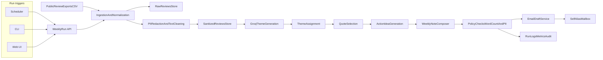

# Groww Weekly Review Pulse - Detailed Architecture

## 1) Goal and Outcome

Build a weekly system that turns recent public mobile app reviews (Google Play + Apple App Store) into a one-page pulse note with:

- Top 3 themes (derived from maximum 5 themes)
- 3 real user quotes (sanitized)
- 3 action ideas
- Draft email sent to self/alias

This supports:

- Product/Growth teams: prioritize what to fix next
- Support teams: align with current user pain points and wins
- Leadership: quick weekly health pulse

## 2) Scope and Constraints

### Functional scope

- Ingest reviews for last 8-12 weeks
- Normalize fields: `rating`, `text` (body only), `date`, `source` — **store titles are not used**; drop reviews whose body has **fewer than 5 words** (configurable via `REVIEW_PULSE_MIN_REVIEW_WORDS`)
- Generate 3-5 themes with LLM (Groq)
- Group reviews under themes
- Build weekly note <= 250 words
- Draft email with weekly note
- On-demand **Web UI** to generate the one-pager and create the email draft (same behavior as CLI-triggered runs)

### Hard constraints

- Use only public review exports (no scraping behind login)
- Maximum 5 themes total in clustering output
- Weekly note must be concise and scannable (<=250 words)
- No PII in any artifact (raw handling policy + strict sanitization output)

## 3) High-Level Architecture

Manual operators can start the same end-to-end pipeline from **CLI** or **Web UI**; both call the same backend APIs and are distinguished only by `trigger_type` / audit metadata. Scheduled runs use the same code path.



## 4) Phase-Wise Delivery Plan

## Phase 1 - Foundations and Data Contracts

### Deliverables

- Repository setup with modular services
- Review schema definitions and validation
- Config for environments (`dev`, `staging`, `prod`)
- Secrets wiring for Groq + email provider

### Output

- Stable interfaces so downstream phases are independent

### Implementation (this repo)

- **Layout (code)**: top-level packages `src/phase1/`, `src/phase2/`, `src/phase3/` (one folder per phase). **`src/review_pulse/`** holds only `contracts.py` and a thin `__init__.py` re-exporting Phase 1 public types.
- **Layout (saved data)**: `data/phase1/` (manifest from `review-pulse-phase1`), `data/phase2/` (optional JSONL/stats from ingest CLI), `data/phase3/` (reserved).
- **Export volume**: `REVIEW_PULSE_MAX_REVIEWS_PER_EXPORT` defaults to **500** (typical single-download cap); set to **5000** (or higher, up to the schema limit) when your export path supports it.
- **Signal filter**: `REVIEW_PULSE_MIN_REVIEW_WORDS` (default **5**) — reviews with shorter body text are excluded; titles are not modeled.
- **Languages**: `REVIEW_PULSE_REVIEW_LANGUAGES` (default **`en`**, comma-separated ISO 639-1 codes). Reviews in other languages are dropped in Phase 3 (`filter_reviews_by_language`). Optional `REVIEW_PULSE_STRICT_LANGUAGE_DETECTION` drops rows when detection is inconclusive.
- **Emoji**: `REVIEW_PULSE_DROP_REVIEWS_WITH_EMOJIS` (default **true**) — reviews whose body contains emoji are dropped (`filter_reviews_without_emojis`, `emoji` library).
- **Phase 1 run**: CLI `review-pulse-phase1` writes `data/phase1/phase1_manifest.json` (redacted effective settings, constants, Phase 3 language summary, example `NormalizedReview`, JSON Schema) after loading `.env`.

## Phase 2 - Data Ingestion (Public Exports)

### Inputs

- Google Play export CSV
- App Store export CSV

### Tasks

- Build parsers for both formats
- Validate required columns and data types
- Normalize into unified schema:
  - `reviewIdInternal` (generated UUID)
  - `source` (`google_play` or `app_store`)
  - `rating` (1-5)
  - `text` (body only; ignore any title column in exports)
  - `reviewDate` (ISO date)
  - `ingestedAt`
  - `weekBucket` (ISO week)
- Filter out rows with fewer than the configured minimum word count on `text` (default 5 words)

### Output

- Unified normalized records persisted in DB

### Implementation (this repo)

- **Google Play** (`phase2/google_play.py`): `utf-8-sig` CSV; columns matched case-insensitively — rating: `Star Rating` / `Review Star Rating`; text: `Review Text` / `Text`; date: `Review Last Update Date and Time` / `Review Submit Date and Time` / `Last Updated`.
- **App Store** (`phase2/app_store.py`): rating: `Rating` / `Star Rating`; text: `Review` / `Review Text` / `Comments` / `Body`; date: `Date` / `Review Date` / `Last Modified` / `Created`.
- **API**: `ingest_csv(path, source, …)` and `CsvIngestionService.import_from_export` return `list[NormalizedReview]`; optional Phase 3 filters via `apply_phase3_text_filters`. CLI: `review-pulse-phase2-ingest CSV --source google_play|app_store [--no-phase3] [--json-out] [--stats-out]`.
- **Dates**: `python-dateutil` parses export date strings; `week_bucket` = ISO week `YYYY-Www`.
- **Remote collection** (optional): `review-pulse-collect` — **App Store** via Apple’s public customer-reviews **RSS** (no account); **Google Play** via `google-play-scraper` (public store HTML, unofficial; may break if Google changes pages). Outputs JSONL under `data/phase2/`. Same Phase 3 text filters apply unless `--no-phase3`.

## Phase 3 - Sanitization and Preprocessing

### Tasks

- Text cleanup:
  - whitespace cleanup
  - duplicate elimination
  - remove empty/noise reviews
- PII redaction:
  - emails
  - phone numbers
  - IDs/order numbers/user handles
  - names if detected by NER pass
- Language handling (implemented in `phase3`):
  - detect language (`langdetect` on body text)
  - filter to configured language set (`REVIEW_PULSE_REVIEW_LANGUAGES`, default `en`)
- Emoji handling (`phase3.emoji_filter`):
  - optionally drop reviews whose body contains emoji (`REVIEW_PULSE_DROP_REVIEWS_WITH_EMOJIS`, default true; `emoji` package)

### Implementation status

- Implemented in `phase3.pipeline.apply_phase3_text_filters` as:
  1. whitespace normalization + duplicate elimination + low-signal/noise removal (`phase3.text_cleanup`)
  2. PII masking for common patterns (email, phone, IDs/order refs, @handles, simple name hints) (`phase3.pii_redaction`)
  3. language filtering (`phase3.language_filter`)
  4. optional emoji filtering (`phase3.emoji_filter`)
- Downstream LLM calls (Phase 4+) should only use this sanitized output.

### Policy

- Downstream LLM calls only use sanitized text
- Never expose raw identity markers in notes, logs, or email

## Phase 4 - Theme Generation and Grouping (Groq)

### LLM roles

1. Theme proposal (3-5 max)
2. Theme consolidation (avoid overlap)
3. Review-to-theme assignment

### Prompt chain

- Prompt A: derive candidate themes from weekly corpus
- Prompt B: merge candidate themes into final 3-5 canonical themes
- Prompt C: assign each review to one theme with confidence

### Determinism controls

- JSON schema validation on responses
- Retry with constrained prompt when schema fails
- fallback strategy:
  - use Gemini when Groq quota/rate-limit is exhausted (`REVIEW_PULSE_GEMINI_API_KEY`)
  - embedding clustering + Groq/Gemini labeler if assignment quality is low

### Output

- `themes` table with weekly theme set
- `review_theme_map` table with confidence

### Implementation status

- **Prompt A (candidate themes):** implemented as CLI `review-pulse-phase4-themes`, reading a Phase 2 JSONL corpus and calling Groq; when Groq is exhausted and Gemini credentials are configured, it automatically falls back to Gemini.
- **Prompt B (theme consolidation):** implemented for chunked runs (`--chunked`) as a merge step into 3-5 canonical themes.
- **Prompt C (review-to-theme assignment):** implemented; emits `review_theme_map` entries with confidence.
- **Determinism controls:** JSON response schema validation is enforced for themes and assignments; each step retries with the same constrained JSON prompt (`--max-retries`, default 1).
- Artifact: `data/phase4/themes_<timestamp>.json` with `themes` and `review_theme_map`.

## Phase 5 - Weekly Insight Generation

### Required output structure

- Top 3 themes with supporting evidence volume
- 3 representative sanitized user quotes
- 3 action ideas with effort/impact tags

### Generation policy

- Quotes must be verbatim from sanitized content
- Action ideas should be specific and testable
- Whole note <=250 words

### Quality gates

- Word count guardrail
- Repetition check (avoid duplicate quotes/themes)
- Hallucination check (quote must map back to source review ID)

### Implementation status

- Implemented as `phase5.build_weekly_pulse` + CLI `review-pulse-phase5-note`.
- Inputs: Phase 4 artifact (`themes`, `review_theme_map`) + Phase 2 sanitized JSONL.
- Output includes `topThemes` (with review counts), 3 mapped verbatim `quotes`, 3 `actionIdeas` with `effort`/`impact`, and a composed `noteText`.
- Quality checks are emitted under `policy`: max 250 words, unique quotes, quote-to-source-id mapping, and max themes <= 5.

## Phase 6 - Email Drafting

### Tasks

- Build templated email body (plain text + optional HTML)
- Add a fee-explanation block in email for a configured scenario (initial scenario: **Mutual Fund Exit Load**)
- Include three concise explanation bullets and source links in the email body
- Subject format:
  - `Groww Weekly Review Pulse - YYYY-WW`
- Create draft in mailbox (self/alias)
- Add metadata footer (week range, review count)
- Recipient email can be passed at runtime by Web UI / API payload (fallback to env default if absent)
- Recipient name can be passed at runtime to personalize greeting (`Hi <name>,`)

### Failure handling

- If email draft fails, keep generated note persisted and retry asynchronously

### Implementation status

- Implemented as `phase6.phase6_run` + service module `phase6.email_draft`.
- Subject format enforced: `Groww Weekly Review Pulse - YYYY-WW`.
- Body templating includes plain text note and optional HTML plus metadata footer (`week_range`, `review_count`, UTC timestamp).
- Recipient handling supports frontend/runtime input (`--to-email` or `phase5.recipientEmail`), with fallback to `REVIEW_PULSE_EMAIL_DRAFT_TO`.
- Personalized greeting is supported via runtime recipient name (`--recipient-name` or `phase5.recipientName`).
- Provider behavior:
  - `email_provider=none`: local file-backed draft artifact (dev/test).
  - `email_provider=gmail`: creates Gmail drafts via IMAP using `REVIEW_PULSE_EMAIL_USERNAME` + `REVIEW_PULSE_EMAIL_PASSWORD`.
  - `email_provider=sendgrid`: currently creates a local draft artifact (end-to-end supported); real SendGrid API send is out of scope for this MVP.
- Failure path persists output (`status=failed`) and appends retry metadata to `data/phase6/retry_queue.jsonl`.

### Fee explanation enrichment (new)

- Add a reusable section in mail body:
  - `Fee Explanation: Mutual Fund Exit Load`
  - `Bullet 1`
  - `Bullet 2`
  - `Bullet 3`
- Source the fee details from approved public pages and include links in the mail footer section (example source: Groww AMC/help content).
- Persist the selected fee scenario, bullets, and source links along with weekly artifacts for auditability.

## Phase 7 - Scheduling, Monitoring, and Operations

### Scheduling and manual triggers

- Scheduler trigger modes:
  - Default (repo): `--mode interval` => every 5 minutes (15:40, 15:45, 15:50, ...) on `day-of-week="*"`, logs to `data/phase7/scheduler.log`.
  - Production: run `review-pulse-scheduler --mode weekly --day-of-week mon --hour 15 --minute 35`.
  - Scheduler downloads at most `1000` reviews total and generates weekly pulses for the last `8` weeks.
  - Email sending is controlled by `--send-now` (repo/local defaults to creating drafts only).
  - Receipt email is fixed to `johnytinu18@gmail.com`.
- Implemented runner: `review-pulse-scheduler` (uses `review-pulse-run-weekly` / same pipeline code).
- Backfill trigger for missing weeks
- **Web UI**: buttons/actions to generate the weekly one-pager and create the email draft for a selected week (same pipeline as CLI; not a separate business logic path)
- **CLI**: retained for automation, scripting, and CI; invokes the same endpoints or shared library entrypoints as the UI

### Monitoring

- Run status: success/failure by phase
- API and token usage metrics (Groq)
- Latency and retry counters
- Redaction incident metrics (count of masked entities)

### Alerting

- Notify on job failure or policy violation
- Include runId and failed phase in alert payload

### Implementation status

- Added `review-pulse-api` FastAPI service (Phase 7) with:
  - `POST /runs/weekly` to trigger Phase 4 -> Phase 5 -> Phase 6 for a given `weekBucket`
  - `GET /runs/{runId}` to poll run status
  - `GET /reports/weekly?week=YYYY-WW` to fetch the generated report JSON
- Added a minimal Next.js Web UI scaffold under `webui/` that calls the Phase 7 API and polls until completion.

### GitHub Actions Scheduler

- Implemented CI trigger by running the local scheduler in “single tick” mode:
  - `review-pulse-scheduler --run-once`
- Configured to run on a weekly cron schedule (UTC in GitHub Actions; adjust to match your local 3:35 PM).
- Uses fixed receipt email `johnytinu18@gmail.com`.

## 5) Component-Level Design

## A) Ingestion Service

Responsibilities:

- Parse CSVs from configured source locations
- Validate records
- Normalize schema and write to DB

Interfaces:

- `POST /ingestion/import?source=google_play`
- `POST /ingestion/import?source=app_store`

## B) Sanitization Service

Responsibilities:

- PII masking and safe text extraction
- Store redaction metadata for audit

Interfaces:

- Internal queue consumer or function call:
  - `sanitizeReviews(batchId)`

## C) LLM Orchestrator (Groq)

Responsibilities:

- Theme generation and assignments
- Quote ranking
- Action idea generation
- Output schema enforcement

Interfaces:

- `generateThemes(weekRange)`
- `assignThemes(weekRange, themes)`
- `generateWeeklyPulse(weekRange, themeAssignments)`

## D) Report Composer

Responsibilities:

- Compose final <=250-word note
- Format into email-ready template
- Run policy checks

Interfaces:

- `composeWeeklyNote(weekRange)`

## E) Email Service

Responsibilities:

- Create email draft to self/alias
- Idempotent retries for transient failure
- Append fee explanation scenario block (title + 3 bullets + source links) when configured

Interfaces:

- `createDraft(to, subject, bodyText, bodyHtml)`
- `buildFeeExplanation(scenario, sourceLinks) -> { fee_scenario, explanation_bullets, source_links, last_checked }`

## F) Web Dashboard (UI)

Responsibilities:

- Let authenticated users pick a week (or “current week”) and **Generate one-pager**: run ingestion through policy gate and persist `weekly_reports`
- **Send draft email** (or “Create mailbox draft”): call `EmailDraftService` with the generated note; show success/failure and link to run status
- Display last run status, report preview, and word count; optional download/export of the one-pager (PDF/Markdown) if needed
- Display fee explanation block preview included in outgoing email (scenario + bullets + links)

Interfaces:

- Calls the same **External API** as CLI (`POST /runs/weekly`, `GET /reports/weekly`, `GET /runs/{runId}`); no duplicate server-side pipeline
- Optional: `POST /runs/weekly/{runId}/email` if email is split into a second explicit step from the UI (still backed by the same `createDraft` service)

## G) Policy Engine

Responsibilities:

- Enforce no-PII output
- Enforce max words and max themes
- Block publish/draft on violation
- Validate fee explanation section exists when fee scenario is enabled
- Validate explanation bullets are sourced (at least one trusted source link present)

Interfaces:

- `validateArtifact(type, content)`

## H) Google Docs Append Service (MCP)

Responsibilities:

- Build a combined JSON payload containing weekly pulse + fee explanation
- Append the payload to a Google Doc using MCP
- Persist append status and Google Doc metadata for replay/audit

Interfaces:

- `appendWeeklyJsonToGoogleDoc(docId, payloadJson)`
- `getLastGoogleDocAppendStatus(runId)`

## 6) Data Model (Suggested)

## `reviews_raw`

- `id` (UUID, PK)
- `source`
- `external_review_id` (nullable)
- `rating`
- `text_raw`
- `review_date`
- `ingested_at`
- `batch_id`

## `reviews_sanitized`

- `id` (UUID, PK)
- `raw_review_id` (FK -> reviews_raw.id)
- `text_sanitized`
- `language`
- `week_bucket`
- `redaction_flags` (JSON)
- `sanitized_at`

## `themes_weekly`

- `id` (UUID, PK)
- `week_bucket`
- `theme_name`
- `theme_description`
- `rank`
- `created_at`

## `review_theme_map`

- `id` (UUID, PK)
- `review_id` (FK -> reviews_sanitized.id)
- `theme_id` (FK -> themes_weekly.id)
- `confidence`
- `assigned_at`

## `weekly_reports`

- `id` (UUID, PK)
- `week_bucket`
- `top_themes_json`
- `quotes_json`
- `actions_json`
- `note_text`
- `word_count`
- `policy_status`
- `generated_at`

## `email_drafts`

- `id` (UUID, PK)
- `report_id` (FK -> weekly_reports.id)
- `to_alias`
- `subject`
- `draft_provider_id`
- `status`
- `created_at`

## `pipeline_runs`

- `run_id` (UUID, PK)
- `week_bucket`
- `trigger_type` (`scheduled`/`cli`/`ui`/`backfill`) — `cli` and `ui` both denote on-demand runs; distinguish for audit and support
- `phase_status_json`
- `error_json`
- `started_at`
- `ended_at`

## `fee_explanations`

- `id` (UUID, PK)
- `week_bucket`
- `scenario` (e.g., `Mutual Fund Exit Load`)
- `explanation_bullets_json`
- `source_links_json`
- `last_checked`
- `created_at`

## `google_doc_appends`

- `id` (UUID, PK)
- `run_id` (FK -> pipeline_runs.run_id)
- `doc_id`
- `payload_json`
- `append_status` (`pending`/`appended`/`failed`)
- `append_error` (nullable)
- `appended_at`

## 7) APIs and Contracts

## External API (used by Web UI and CLI)

The Web UI and CLI are thin clients over the same API. Request body or headers should record `trigger_type` (`cli` vs `ui`) for `pipeline_runs`.

- `POST /runs/weekly?week=YYYY-WW` — full pipeline: normalize → themes → one-pager → policy → optional email draft (or split email into a follow-up call below)
- `POST /runs/backfill?from=YYYY-WW&to=YYYY-WW`
- `GET /reports/weekly?week=YYYY-WW` — fetch generated one-pager for display/export in the UI
- `GET /runs/{runId}` — poll progress for long runs (UI progress indicator)
- Optional explicit step: `POST /runs/{runId}/email` — create mailbox draft from an already-succeeded run (if product wants “generate first, send draft second” in the UI)
- Optional explicit step: `POST /runs/{runId}/google-doc-append` — append combined JSON payload to Google Doc via MCP

## Internal response schema examples

### Theme generation output

```json
{
  "week": "2026-W11",
  "themes": [
    { "name": "PaymentFailures", "description": "UPI or bank transfer failures", "rank": 1 },
    { "name": "AppPerformance", "description": "Lag, crashes, slow loading", "rank": 2 },
    { "name": "SupportExperience", "description": "Response quality and delay", "rank": 3 }
  ]
}
```

### Weekly pulse output

```json
{
  "week": "2026-W11",
  "topThemes": [
    "PaymentFailures",
    "AppPerformance",
    "SupportExperience"
  ],
  "quotes": [
    "Transfer fails repeatedly even after retries.",
    "App freezes on portfolio screen every morning.",
    "Support took days to respond to urgent issue."
  ],
  "actionIdeas": [
    "Add retry diagnostics and visible failure reason for UPI transfers.",
    "Profile startup and portfolio rendering path to reduce freeze rate.",
    "Introduce first-response SLA alerts for high-severity support tickets."
  ],
  "wordCount": 112
}
```

### Combined JSON payload for Google Doc append (new)

```json
{
  "date": "2026-03-15",
  "weekly_pulse": {
    "themes": ["Theme 1", "Theme 2", "Theme 3"],
    "quotes": ["Quote 1", "Quote 2", "Quote 3"],
    "action_ideas": ["Action 1", "Action 2", "Action 3"]
  },
  "fee_scenario": "Mutual Fund Exit Load",
  "explanation_bullets": [
    "Fact 1...",
    "Fact 2...",
    "Fact 3..."
  ],
  "source_links": ["Link 1", "Link 2"],
  "last_checked": "2026-03-15"
}
```

### Mail section format (new)

```text
Fee Explanation: Mutual Fund Exit Load
- Bullet 1
- Bullet 2
- Bullet 3
```

## 8) Groq Integration Design

## Model interaction pattern

- Use low-temperature, structured prompting for extraction/classification
- Use moderate creativity for action ideation
- Always force JSON output for intermediate steps

## Reliability controls

- JSON schema validator
- Automatic retry with stricter prompt
- Guardrails:
  - max themes <= 5
  - output quotes must match known sanitized reviews
  - no entity pattern leak in final text

## Cost controls

- Chunk large review sets by week
- Cache theme assignments for unchanged windows
- Limit token input by removing low-signal records

## 9) Security and Privacy

- Secrets in environment vault (never hardcoded)
- Encrypt data at rest and in transit
- Role-based access for report retrieval endpoints and for UI actions that start runs or create drafts
- Strict log hygiene:
  - log IDs and counters, not raw text where avoidable
- PII gate before:
  - LLM calls
  - report persistence
  - email drafting

## 10) Deployment Architecture (Hybrid MVP -> Cloud)

## Local MVP

- Runtime: Python/Node worker + small **Web UI** (e.g. static SPA or server-rendered) calling the local API
- Scheduler: local cron
- DB: SQLite
- Email: Gmail draft API

## Production target

- Containerized services
- Scheduler: managed cron/job service
- DB: Postgres
- Queue: managed queue (optional)
- Observability: centralized logs + metrics dashboard

## 11) CI/CD and Testing Strategy

## Tests

- Unit:
  - CSV parsing
  - redaction functions
  - prompt output schema parsing
- Integration:
  - end-to-end weekly run with fixture reviews
- Policy tests:
  - ensure PII is masked in generated notes
  - ensure word count <= 250

## CI gates

- Lint + type checks
- Unit + integration tests
- Snapshot tests for weekly note format

## 12) Failure Modes and Mitigations

- CSV format drift:
  - schema version detector + parser adapters
- Groq malformed output:
  - strict schema validation + retry fallback
- Low-quality themes:
  - semantic clustering fallback + human override
- Email API outage:
  - queued retry and status tracking
- PII leak risk:
  - dual-pass redaction + final policy blocker

## 13) Runbook (Weekly Job)

1. Trigger scheduler for current week window (or on-demand via **CLI** or **Web UI** using the same steps)
2. Import latest public exports
3. Sanitize and preprocess all eligible reviews
4. Generate and assign themes (3-5 max)
5. Compose one-page note (<=250 words)
6. Run policy checks (PII + format)
7. Create email draft to self/alias
8. Persist run metrics and finalize status

## 14) Success Metrics

- Pipeline reliability: weekly run success rate >= 99%
- Data freshness: report generated within scheduled window
- Actionability: % action ideas accepted by product team
- Signal quality: theme stability week-over-week
- Compliance: zero PII incidents in artifacts

## 15) Recommended Folder Structure

```text
project/
  src/
    phase1/       # package: config, schemas, phase1_run, text_utils
    phase2/       # package: CSV ingestion (Google Play + App Store), phase2_run
    phase3/       # package: language + emoji filters, pipeline
    review_pulse/ # contracts + re-exports only
    ingestion/    # optional alternate layout for services
    sanitization/
    llm/
    reporting/
    email/
    policy/
    scheduler/
    api/
    web/          # dashboard UI (calls api/)
  prompts/
    themes/
    assignments/
    weekly_note/
  data/
    phase1/       # phase1_manifest.json (and similar)
    phase2/       # optional ingest outputs
    phase3/       # reserved
  tests/
    unit/
    integration/
    fixtures/
  docs/
    architecture/
  configs/
```

## 16) Execution Rollout Plan (Fee Scenario + Google Doc MCP)

This rollout adds:
1) fee explanation enrichment (`Mutual Fund Exit Load`) in mail, and  
2) combined JSON append to Google Doc via MCP.

### Phase 16.1 - Fee scenario content pipeline

**Owner:** Backend + Content/Research  
**Goal:** reliably produce 3 factual bullets + source links for the configured fee scenario.

Tasks:
- Add a fee-scenario config contract:
  - `fee_scenario` (default: `Mutual Fund Exit Load`)
  - `fee_sources` (allowlist of approved domains/pages)
- Implement `buildFeeExplanation(scenario, sourceLinks)` service to output:
  - `fee_scenario`
  - `explanation_bullets` (exactly 3 short bullets)
  - `source_links` (>=1)
  - `last_checked` (UTC date)
- Add fallback behavior:
  - if source fetch fails, keep weekly pulse generation successful
  - mark fee block status as degraded and include retry metadata
- Persist fee explanation artifact under run output and in `fee_explanations`.

Acceptance criteria:
- For a run with fee scenario enabled, output contains exactly 3 bullets and >=1 source link.
- Bullets are non-empty, non-duplicate, and scenario-specific.
- Failed fetch does not break weekly pulse generation; failure is visible in run status metadata.

### Phase 16.2 - Email template enrichment

**Owner:** Backend (Email Service)  
**Goal:** append fee explanation block to outgoing mail body (text + HTML).

Tasks:
- Update mail composition to include:
  - `Fee Explanation: Mutual Fund Exit Load`
  - bullet list (3 items)
  - source links section
- Ensure personalization and existing metadata footer remain intact.
- Add policy check in email pre-send validation:
  - when `fee_scenario` enabled, fee block must exist and be non-empty.

Acceptance criteria:
- Draft email includes fee section in both text and HTML representations.
- Existing weekly pulse content and footer still render correctly.
- `sendNow=false` and `sendNow=true` paths both include fee section.

### Phase 16.3 - Combined JSON contract + run output

**Owner:** Backend API  
**Goal:** generate and persist the exact combined payload contract.

Tasks:
- Build `combined_payload.json` per run with schema:
  - `date`
  - `weekly_pulse` (`themes`, `quotes`, `action_ideas`)
  - `fee_scenario`
  - `explanation_bullets`
  - `source_links`
  - `last_checked`
- Ensure keys are stable and backward-compatible for downstream consumers.
- Store payload in run directory and optionally in `google_doc_appends.payload_json`.

Acceptance criteria:
- Payload keys and value types match documented JSON contract exactly.
- Payload is available immediately after successful run completion.
- Quotes/actions in payload map to Phase 5 output for the same run/week.

### Phase 16.4 - Google Doc append via MCP

**Owner:** Backend Integrations  
**Goal:** append combined JSON to a target Google Doc and track append status.

Tasks:
- Implement MCP client adapter:
  - `appendWeeklyJsonToGoogleDoc(docId, payloadJson)`
- Add API endpoint:
  - `POST /runs/{runId}/google-doc-append`
- Store append audit:
  - `doc_id`, `append_status`, `append_error`, `appended_at`
- Add idempotency guard (avoid duplicate appends for same `runId` + `docId` unless forced).

Acceptance criteria:
- Successful API call appends JSON to doc and returns append metadata.
- Repeated call with same `runId` + `docId` is idempotent by default.
- Failure path returns actionable error and persists audit row with `failed` status.

### Phase 16.5 - QA, observability, and go-live

**Owner:** QA + Backend  
**Goal:** production-ready rollout with monitoring and rollback.

Tasks:
- Unit tests:
  - fee bullet generation/validation
  - email fee section rendering (text/html)
  - combined JSON schema validation
  - MCP adapter response/error handling
- Integration tests:
  - end-to-end run with fee scenario + google-doc append
- Metrics/logging:
  - fee block generation success rate
  - doc append success rate and latency
- Feature flags:
  - `ENABLE_FEE_EXPLANATION`
  - `ENABLE_GOOGLE_DOC_APPEND`

Acceptance criteria:
- CI passes all new tests.
- Staging run produces valid mail + valid combined JSON + successful doc append.
- Rollback path verified by disabling feature flags without impacting baseline weekly pulse flow.

---

This architecture is implementation-ready for a Groq-based weekly review pulse system and can be executed incrementally phase by phase without redesign.
